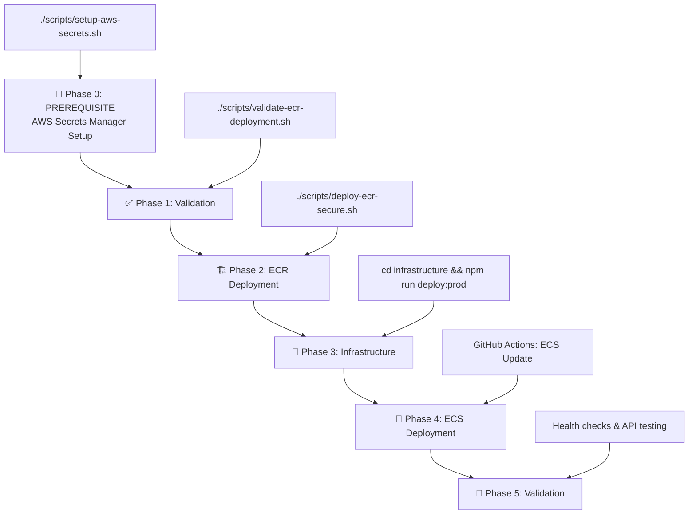

# 🚀 SECURE DEPLOYMENT WORKFLOW

**UPDATED**: Correct deployment order with prerequisites clearly defined.

---

## 📋 **DEPLOYMENT PHASES OVERVIEW**



---

## 🔐 **PHASE 0: PREREQUISITE - AWS Secrets Manager Setup**

### **❗ MUST RUN FIRST ❗**

```bash
# Interactive setup for production credentials
./scripts/setup-aws-secrets.sh
```

**What this script does**:
1. ✅ **Prompts for credentials** (secure input, no echo for passwords)
2. ✅ **Creates AWS Secrets**: 
   - `finbert-rag/elasticsearch/credentials`
   - `finbert-rag/api/tokens`
3. ✅ **Sets IAM permissions** for ECS to access secrets
4. ✅ **Generates ECS config** (`ecs-secrets-config.json`)
5. ✅ **Verifies access** to ensure secrets are retrievable

**Required inputs**:
- Elasticsearch Cloud Host
- Elasticsearch API Key  
- HuggingFace Token
- Optional: NewsAPI, Finnhub, AlphaVantage keys

**Output files**:
- `ecs-secrets-config.json` - ECS task definition snippet

---

## ✅ **PHASE 1: Validation**

```bash
# Validates prerequisites and environment
./scripts/validate-ecr-deployment.sh
```

**Enhanced validation checks**:
- ✅ AWS CLI and Docker installed
- ✅ AWS credentials and permissions
- ✅ Git repository status
- ✅ Docker files present
- ✅ **NEW**: AWS Secrets Manager accessibility
- ✅ **NEW**: ECR permissions verification

---

## 🏗️ **PHASE 2: SECURE ECR Deployment**  

```bash
# Secure deployment with credential protection
./scripts/deploy-ecr-secure.sh
```

**Security enhancements**:
1. ✅ **Credential scanning** - Detects hardcoded secrets
2. ✅ **Secure git commits** - Ensures no credentials committed
3. ✅ **ECR security** - Vulnerability scanning enabled
4. ✅ **Environment templates** - No real credentials in files
5. ✅ **Production guidance** - AWS Secrets Manager integration

---

## 🔧 **PHASE 3: Infrastructure Deployment**

```bash
# Deploy AWS infrastructure with secrets integration
cd infrastructure && npm run deploy:prod
```

**Infrastructure components**:
- ✅ **ECS Cluster**: finbert-rag-prod
- ✅ **Task Definition**: With Secrets Manager integration
- ✅ **Load Balancer**: HTTPS with health checks
- ✅ **Auto Scaling**: CPU/memory based scaling
- ✅ **CloudWatch**: Comprehensive logging and monitoring

---

## 🚀 **PHASE 4: ECS Deployment (Automatic)**

**Triggered by**: GitHub Actions on git push to main

**GitHub Actions workflow**:
1. ✅ **Image pull** from ECR
2. ✅ **Task definition update** with new images
3. ✅ **ECS service update** (rolling deployment)
4. ✅ **Health check monitoring**
5. ✅ **Deployment verification**

---

## 🧪 **PHASE 5: Production Validation**

**Automatic validation**:
- ✅ **Health endpoint**: `/health` responding < 100ms
- ✅ **API endpoints**: All 3 endpoints (384d, 768d, 1155d) < 0.5s
- ✅ **Model caching**: No downloads in logs
- ✅ **Secrets access**: Environment variables populated from Secrets Manager
- ✅ **Performance**: 4.9x speedup maintained

---

## 🚨 **CRITICAL: Why Prerequisites Matter**

### **❌ Without AWS Secrets Manager Setup**:
- ECS tasks fail to start (missing environment variables)
- Application crashes on Elasticsearch connection
- API endpoints return 500 errors
- No way to securely access credentials

### **✅ With Proper Prerequisites**:
- ECS tasks start successfully with all credentials
- Elasticsearch connections established securely
- All API endpoints operational immediately
- Zero credential exposure in code or logs

---

## 📋 **COMPLETE DEPLOYMENT CHECKLIST**

### **Phase 0: Prerequisites ⚡**
- [ ] **Run**: `./scripts/setup-aws-secrets.sh`
- [ ] **Verify**: Secrets created in AWS Secrets Manager
- [ ] **Confirm**: `ecs-secrets-config.json` generated

### **Phase 1-2: ECR Deployment**
- [ ] **Run**: `./scripts/validate-ecr-deployment.sh`
- [ ] **Run**: `./scripts/deploy-ecr-secure.sh`  
- [ ] **Verify**: Images in ECR with security scanning

### **Phase 3: Infrastructure**
- [ ] **Run**: `cd infrastructure && npm run deploy:prod`
- [ ] **Verify**: ECS cluster and services created
- [ ] **Check**: Load balancer DNS accessible

### **Phase 4-5: Validation**
- [ ] **Monitor**: GitHub Actions deployment
- [ ] **Test**: Health and API endpoints
- [ ] **Confirm**: Performance targets met

---

## 🎯 **READY TO EXECUTE**

**Complete command sequence**:
```bash
# 1. PREREQUISITE (MUST DO FIRST)
./scripts/setup-aws-secrets.sh

# 2. Validate environment  
./scripts/validate-ecr-deployment.sh

# 3. Deploy to ECR securely
./scripts/deploy-ecr-secure.sh

# 4. Deploy infrastructure
cd infrastructure && npm run deploy:prod

# 5. Monitor deployment (automatic via GitHub Actions)
# GitHub Actions handles ECS deployment when you push to main
```

**Expected total time**: ~45-60 minutes (including prerequisite setup)

---

**🔐 SECURITY-FIRST DEPLOYMENT - PREREQUISITES ARE ESSENTIAL! 🔐**